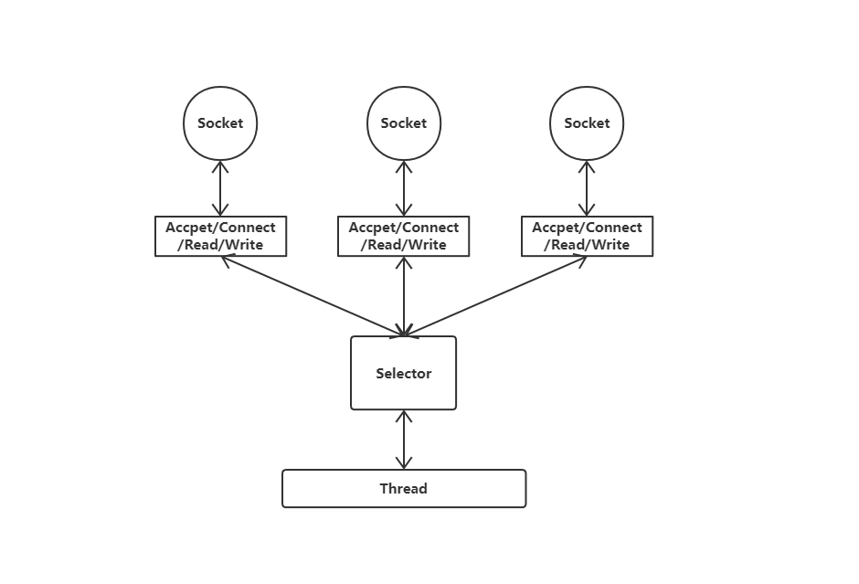
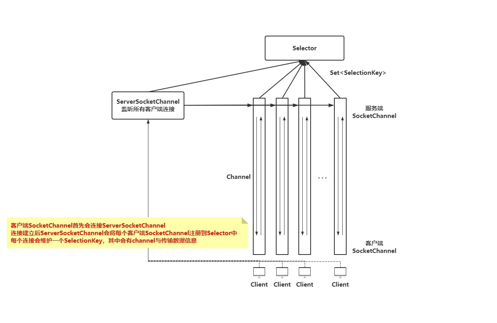
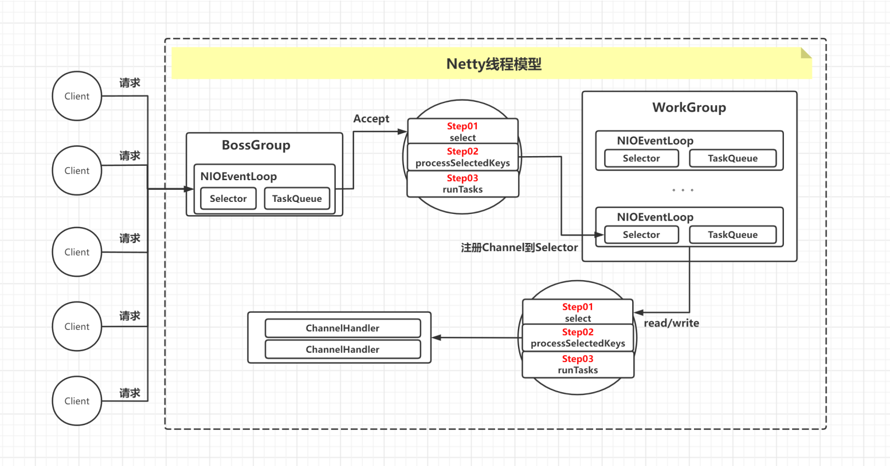
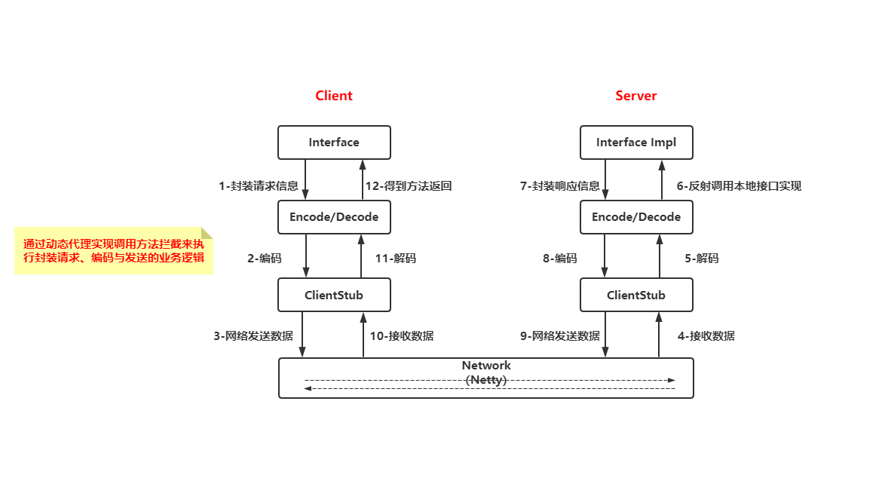

# 网络编程-IO&Netty

> IO&Netty代码地址：https://github.com/806040464/thinking-in-netty
>
> 手写Rpc&Web容器代码地址：https://github.com/806040464/rpc-tomcat-custom
>
> 文档地址：https://www.yuque.com/zhaocongcong/kb/uh0lou

## JAVAIO

### BIO

**basic IO（block IO）**，主要用于文件IO与网络IO，JDK1.4 之前，我们建立网络连接的时候只能采用
BIO，使用ServerSocket与Socket进行通信，客户端发送请求后会一直等待服务端响应，是阻塞式IO。java.io.*与java.net.*包

### NIO

java.nio 全称 **Java Non-Blocking IO**，java.nio.*包

BIO 以流的方式处理数据，而 NIO 以块的方式处理数据，效率要高

NIO 是非阻塞式的，这一点跟 BIO 也很不相同，可以提升资源利用效率

核心部分：

- Channel通道

- Buffer缓冲区

- Selector选择器

NIO 基于 Channel和 Buffer进行操作，数据总是从通道读取到缓冲区中，或者从缓冲区写入到通道中。Selector用于监听多个通道的事件（**Accpet、Connect、Read、Write**），**
一个线程就可以处理大量客户端连接**





### IO对比

IO 的方式通常分为几种：同步阻塞的 BIO、同步非阻塞的 NIO、异步非阻塞的 AIO

- BIO 方式适用于连接数目比较小且固定的架构

- NIO 方式适用于连接数目多且连接比较短（轻操作）的架构，如聊天服务器

- AIO 方式使用于连接数目多且连接比较长（重操作）的架构，如文件服务器

|             | BIO  | NIO         | AIO   |
|:----------- |:----:|:-----------:|:-----:|
| **IO方式**    | 同步阻塞 | 同步非阻塞（多路复用） | 异步非阻塞 |
| **API使用难度** | 简单   | 复杂          | 复杂    |
| **可靠性**     | 差    | 好           | 好     |
| **吞吐量**     | 低    | 高           | 高     |

### C/S通信（NIO）

```java
import java.io.IOException;
import java.net.InetSocketAddress;
import java.nio.ByteBuffer;
import java.nio.channels.SocketChannel;
import java.nio.charset.StandardCharsets;

public class Client {
    public static void main(String[] args) throws Exception {
        start();
    }

    public static void start() throws IOException {
        //开启网络通道
        SocketChannel socketChannel = SocketChannel.open();
        //设置非阻塞
        socketChannel.configureBlocking(false);
        InetSocketAddress address = new InetSocketAddress("127.0.0.1", 9999);
        //连接服务器
        if (!socketChannel.connect(address)) {
            //重试连接
            while (!socketChannel.finishConnect()) {
                System.out.println("Client：金莲连不上，做点别的事");
            }
        }
        ByteBuffer byteBuffer = ByteBuffer.wrap("你好，金莲，大郎在家吗？".getBytes(StandardCharsets.UTF_8));
        //发送消息
        socketChannel.write(byteBuffer);
        try {
            Thread.sleep(10000);
        } catch (InterruptedException e) {
            throw new RuntimeException(e);
        }
    }
}
```

```java
import java.io.IOException;
import java.net.InetSocketAddress;
import java.nio.ByteBuffer;
import java.nio.channels.SelectionKey;
import java.nio.channels.Selector;
import java.nio.channels.ServerSocketChannel;
import java.nio.channels.SocketChannel;
import java.util.Iterator;

public class Server {
    public static void main(String[] args) throws IOException {
        start();
    }

    public static void start() throws IOException {
        System.out.println("服务端启动");
        System.out.println("服务端初始化端口：9999");
        //开启socket通道监听
        ServerSocketChannel serverSocketChannel = ServerSocketChannel.open();
        //开启选择器
        Selector selector = Selector.open();
        //设置为非阻塞
        serverSocketChannel.configureBlocking(false);
        //绑定端口
        serverSocketChannel.bind(new InetSocketAddress(9999));
        //注册到选择器，选择器监听ACCEPT事件
        serverSocketChannel.register(selector, SelectionKey.OP_ACCEPT);
        while (true) {
            if (0 == selector.select(1000)) {
                System.out.println("Server:西门庆没找我，我去找王妈妈做点兼职");
                continue;
            }

            Iterator<SelectionKey> iterator = selector.selectedKeys().iterator();
            while (iterator.hasNext()) {
                SelectionKey key = iterator.next();
                if (key.isAcceptable()) {
                    SocketChannel clientSocketChannel = serverSocketChannel.accept();
                    clientSocketChannel.configureBlocking(false);
                    clientSocketChannel.register(selector, SelectionKey.OP_READ, ByteBuffer.allocate(1024));
                }
                if (key.isReadable()) {
                    SocketChannel channel = (SocketChannel) key.channel();
                    ByteBuffer byteBuffer = (ByteBuffer) key.attachment();
                    System.out.println("客户端发来数据：" + new String(byteBuffer.array()).trim());
                    channel.read(byteBuffer);
                    System.out.println("客户端发来数据：" + new String(byteBuffer.array()).trim());
                }
                //将当前key移除，防止重复处理
                iterator.remove();
            }
        }
    }
}
```

### 网络聊天室1.0（Java NIO）

```java
import java.io.IOException;
import java.net.InetSocketAddress;
import java.nio.ByteBuffer;
import java.nio.channels.SocketChannel;
import java.nio.charset.StandardCharsets;

public class Client {
    private final String HOST = "127.0.0.1";
    private final int PORT = 9999;
    private String userName;
    private SocketChannel socketChannel;

    public Client() {
        try {
            //开启网络通道
            this.socketChannel = SocketChannel.open();
            InetSocketAddress address = new InetSocketAddress(HOST, PORT);
            //设置非阻塞
            this.socketChannel.configureBlocking(false);
            //连接服务器
            if (!socketChannel.connect(address)) {
                //重试连接
                while (!socketChannel.finishConnect()) {
                    System.out.println("Client：还没连接上服务器，干点别的");
                }
            }
            this.userName = socketChannel.getLocalAddress().toString();
            System.out.println("Client" + userName + "is Ready!");
        } catch (IOException e) {
            throw new RuntimeException(e);
        }
    }

    /**
     * 向服务器发送消息
     *
     * @param msg
     */
    public void sendMsg(String msg) {
        try {
            if ("bye".equalsIgnoreCase(msg)) {
                socketChannel.close();
            }
            msg = userName + "说：" + msg;
            ByteBuffer byteBuffer = ByteBuffer.wrap(msg.getBytes(StandardCharsets.UTF_8));
            socketChannel.write(byteBuffer);
        } catch (IOException e) {
            throw new RuntimeException(e);
        }
    }

    /**
     * 从服务端接收消息
     */
    public void receiveMsg() {
        try {
            ByteBuffer byteBuffer = ByteBuffer.allocate(1024);
            int read = socketChannel.read(byteBuffer);
            if (read > 0) {
                String msg = new String(byteBuffer.array()).trim();
                System.out.println(msg);
            }
        } catch (IOException e) {
            throw new RuntimeException(e);
        }
    }
}
```

```java
import java.io.IOException;
import java.net.InetSocketAddress;
import java.nio.ByteBuffer;
import java.nio.channels.*;
import java.nio.charset.StandardCharsets;
import java.text.SimpleDateFormat;
import java.util.Date;
import java.util.Iterator;

public class Server {
    private ServerSocketChannel serverSocketChannel;
    private Selector selector;
    private static final int PORT = 9999;

    public static void main(String[] args) {
        Server server = new Server();
        server.start();
    }

    public Server() {
        try {
            System.out.println("服务端启动");
            System.out.println("服务端初始化端口：9999");
            //开启socket监听通道
            this.serverSocketChannel = ServerSocketChannel.open();
            //开启选择器
            this.selector = Selector.open();
            //设置非阻塞
            this.serverSocketChannel.configureBlocking(false);
            //绑定端口
            this.serverSocketChannel.bind(new InetSocketAddress(PORT));
            //注册选择器，选择器监听ACCEPT事件
            this.serverSocketChannel.register(selector, SelectionKey.OP_ACCEPT);
        } catch (IOException e) {
            throw new RuntimeException(e);
        }
    }

    public void start() {
        try {
            while (true) {
                if (0 == selector.select(1000)) {
                    System.out.println("没有客户端连接，我去搞点兼职");
                    try {
                        Thread.sleep(1000);
                    } catch (InterruptedException e) {
                        throw new RuntimeException(e);
                    }
                    continue;
                }
                Iterator<SelectionKey> iterator = selector.selectedKeys().iterator();
                if (iterator.hasNext()) {
                    SelectionKey key = iterator.next();
                    if (key.isAcceptable()) {
                        SocketChannel clientSocketChannel = serverSocketChannel.accept();
                        clientSocketChannel.configureBlocking(false);
                        clientSocketChannel.register(selector, SelectionKey.OP_READ);
                        System.out.println(clientSocketChannel.getRemoteAddress().toString() + "上线了");
                    }
                    if (key.isReadable()) {
                        readMsg(key);
                    }
                    //将当前key移除，防止重复处理
                    iterator.remove();
                }
            }
        } catch (IOException e) {
            throw new RuntimeException(e);
        }
    }

    /**
     * 读取客户端发来的消息并广播
     *
     * @param key
     * @throws IOException
     */
    private void readMsg(SelectionKey key) throws IOException {
        SocketChannel clientSocketChannel = (SocketChannel) key.channel();
        ByteBuffer byteBuffer = ByteBuffer.allocate(1024);
        int read = clientSocketChannel.read(byteBuffer);
        if (read > 0) {
            String msg = new String(byteBuffer.array()).trim();
            //打印消息
            printInfo(msg);
            //全员广播消息，除发送客户端外
            broadcast(clientSocketChannel, msg);
        }
    }

    private void broadcast(SocketChannel clientSocketChannel, String msg) throws IOException {
        System.out.println("服务器广播消息");
        for (SelectionKey selectionKey : selector.keys()) {
            SelectableChannel targetChannel = selectionKey.channel();
            if (targetChannel instanceof SocketChannel && targetChannel != clientSocketChannel) {
                SocketChannel destChannel = (SocketChannel) targetChannel;
                ByteBuffer wrap = ByteBuffer.wrap(msg.getBytes(StandardCharsets.UTF_8));
                destChannel.write(wrap);
            }
        }
    }

    private void printInfo(String msg) {
        SimpleDateFormat sdf = new SimpleDateFormat("yyyy-MM-dd HH:mm:ss");
        System.out.println("[" + sdf.format(new Date()) + "]->" + msg);
    }
}
```

## Netty

Netty 是一个利用 Java 开发的高级网络的能力，隐藏其背后的复杂性而提供一个易于使用的 API 的客户端/服务器框架

Netty提供**异步的、事件驱动的网络应用程序框架和工具**，用以快速开发高性能、高可靠性的网络服务器和客户端程序。也就是说，Netty 是一个**基于NIO的客户、服务器端编程框架**，使用Netty 可以快速和简单的开发出一个网络应用

### 线程模型



### API 默认的pipeline里的handler有哪些？排序是按添加顺序，是否支持类似order注解定义，Handler如何跳过执行下一个或者说Handler间如何通知？

- ChannelInboundHandler之间的传递，通过**调用 ctx.fireChannelRead(msg) 实现**；**调用ctx.write(msg) 将传递到ChannelOutboundHandler**

- ChannelOutboundHandler 在注册的时候需要放在**最后一个ChannelInboundHandler之前**，否则将无法传递到ChannelOutboundHandler

- 流水线pipeline中**ChannelOutboundHandler不能放到最后**，否则不生效

- ctx.write()方法执行后，需要调用flush()方法才能令它立即执行，writeAndFlush()

### C/S通信（Netty实现）

```java
import io.netty.bootstrap.Bootstrap;
import io.netty.channel.ChannelFuture;
import io.netty.channel.ChannelInitializer;
import io.netty.channel.nio.NioEventLoopGroup;
import io.netty.channel.socket.SocketChannel;
import io.netty.channel.socket.nio.NioSocketChannel;
import io.netty.handler.logging.LogLevel;
import io.netty.handler.logging.LoggingHandler;

public class NettyClient {

    public static void main(String[] args) throws InterruptedException {
        //创建线程组
        NioEventLoopGroup group = new NioEventLoopGroup();
        //创建客户端启动助手
        Bootstrap bootstrap = new Bootstrap();
        bootstrap.group(group)
                .channel(NioSocketChannel.class)
                .handler(new ChannelInitializer<SocketChannel>() {
                    @Override
                    protected void initChannel(SocketChannel ch) throws Exception {
                        ch.pipeline().addLast(new LoggingHandler(LogLevel.INFO));
                        ch.pipeline().addLast(new NettyClientHandler());
                    }
                });
        System.out.println("客户端启动完成");
        ChannelFuture channelFuture = bootstrap.connect("127.0.0.1", 9999).sync();
        channelFuture.channel().closeFuture().sync();
    }
}
```

```java
import io.netty.buffer.ByteBuf;
import io.netty.buffer.Unpooled;
import io.netty.channel.ChannelHandlerContext;
import io.netty.channel.ChannelInboundHandlerAdapter;

import java.nio.charset.StandardCharsets;

/**
 * 客户端业务类
 */
public class NettyClientHandler extends ChannelInboundHandlerAdapter {
    @Override
    public void channelActive(ChannelHandlerContext ctx) throws Exception {
        ctx.writeAndFlush(Unpooled.copiedBuffer("天王盖地虎".getBytes(StandardCharsets.UTF_8)));
    }

    @Override
    public void channelRead(ChannelHandlerContext ctx, Object msg) throws Exception {
        ByteBuf byteBuf = (ByteBuf) msg;
        System.out.println("Server msg:" + byteBuf.toString(StandardCharsets.UTF_8));
    }

    @Override
    public void exceptionCaught(ChannelHandlerContext ctx, Throwable cause) throws Exception {
        ctx.close();
    }
}
```

```java
import io.netty.bootstrap.ServerBootstrap;
import io.netty.channel.ChannelFuture;
import io.netty.channel.ChannelInitializer;
import io.netty.channel.ChannelOption;
import io.netty.channel.nio.NioEventLoopGroup;
import io.netty.channel.socket.SocketChannel;
import io.netty.channel.socket.nio.NioServerSocketChannel;
import io.netty.handler.logging.LogLevel;
import io.netty.handler.logging.LoggingHandler;

public class NettyServer {
    public static void main(String[] args) throws InterruptedException {
        //创建线程组，处理客户端连接
        NioEventLoopGroup bossGroup = new NioEventLoopGroup();
        //创建线程组，处理业务操作
        NioEventLoopGroup workerGroup = new NioEventLoopGroup();
        //创建服务端启动助手配置参数
        ServerBootstrap serverBootstrap = new ServerBootstrap();
        serverBootstrap.group(bossGroup, workerGroup)
                //使用NioServerSocketChannel作为服务器端通道的实现
                .channel(NioServerSocketChannel.class)
                //设置线程队列中等待连接的个数
                .option(ChannelOption.SO_BACKLOG, 128)
                //保持活动连接状态
                .childOption(ChannelOption.SO_KEEPALIVE, true)
                //创建初始化通道
                .childHandler(new ChannelInitializer<SocketChannel>() {
                    @Override
                    protected void initChannel(SocketChannel channel) throws Exception {
                        channel.pipeline().addLast(new LoggingHandler(LogLevel.INFO));
                        //Pipeline链中添加自定义的handler类
                        channel.pipeline().addLast(new NettyServerHandler());
                    }
                });
        System.out.println("服务端启动中 init port：9999");
        //绑定端口 bind方法是异步的
        //sync方法是同步阻塞的
        ChannelFuture channelFuture = serverBootstrap.bind(9999).sync();
        System.out.println("服务端启动成功");
        //关闭通道，关闭线程组
        channelFuture.channel().closeFuture().sync();
    }
}
```

```java
import io.netty.buffer.ByteBuf;
import io.netty.buffer.Unpooled;
import io.netty.channel.ChannelHandlerContext;
import io.netty.channel.ChannelInboundHandlerAdapter;

import java.nio.charset.StandardCharsets;

/**
 * 服务端业务类
 */
public class NettyServerHandler extends ChannelInboundHandlerAdapter {
    @Override
    public void channelRead(ChannelHandlerContext ctx, Object msg) throws Exception {
        ByteBuf byteBuf = (ByteBuf) msg;
        System.out.println("client msg:" + byteBuf.toString(StandardCharsets.UTF_8));
    }

    @Override
    public void channelReadComplete(ChannelHandlerContext ctx) throws Exception {
        ctx.writeAndFlush(Unpooled.copiedBuffer("宝塔镇河妖".getBytes(StandardCharsets.UTF_8)));
    }

    @Override
    public void exceptionCaught(ChannelHandlerContext ctx, Throwable cause) throws Exception {
        ctx.close();
    }
}
```

### 网络聊天室V2.0

```java
import io.netty.bootstrap.Bootstrap;
import io.netty.channel.ChannelFuture;
import io.netty.channel.ChannelInitializer;
import io.netty.channel.nio.NioEventLoopGroup;
import io.netty.channel.socket.SocketChannel;
import io.netty.channel.socket.nio.NioSocketChannel;
import io.netty.handler.codec.string.StringDecoder;
import io.netty.handler.codec.string.StringEncoder;

import java.util.Scanner;

/**
 * 客户端
 */
public class ChatNettyClient {
    private final String host;
    private final int port;

    public static void main(String[] args) throws InterruptedException {
        ChatNettyClient chatNettyClient = new ChatNettyClient("127.0.0.1", 9999);
        chatNettyClient.run();
    }

    public ChatNettyClient(String host, int port) {
        this.host = host;
        this.port = port;
    }

    public void run() throws InterruptedException {
        NioEventLoopGroup group = new NioEventLoopGroup();
        try {
            Bootstrap bootstrap = new Bootstrap();
            bootstrap.group(group)
                    .channel(NioSocketChannel.class)
                    .handler(new ChannelInitializer<SocketChannel>() {
                        @Override
                        protected void initChannel(SocketChannel ch) throws Exception {
                            ch.pipeline().addLast("decoder", new StringDecoder());
                            ch.pipeline().addLast("encoder", new StringEncoder());
//                            ch.pipeline().addLast(new ChatClientHandler());
                            ch.pipeline().addLast(new NettyChatClientHandler());
                        }
                    });
            ChannelFuture channelFuture = bootstrap.connect(host, port).sync();
            System.out.println("------" + channelFuture.channel().localAddress().toString() + "------");
            Scanner scanner = new Scanner(System.in);
            while (scanner.hasNextLine()) {
                String msg = scanner.nextLine();
                channelFuture.channel().writeAndFlush(msg + "\r\n");
            }
            channelFuture.channel().closeFuture().sync();
        } finally {
            group.shutdownGracefully();
        }
    }
}
```

```java
import io.netty.channel.Channel;
import io.netty.channel.ChannelHandlerContext;
import io.netty.channel.ChannelInboundHandlerAdapter;

import java.util.List;
import java.util.concurrent.CopyOnWriteArrayList;

/**
 * 客户端业务类
 */
public class ChatClientHandler extends ChannelInboundHandlerAdapter {
    public static List<Channel> channels = new CopyOnWriteArrayList<>();

    @Override
    public void channelRead(ChannelHandlerContext ctx, Object msg) throws Exception {
        System.out.println(msg.toString());
    }

    @Override
    public void exceptionCaught(ChannelHandlerContext ctx, Throwable cause) throws Exception {
        ctx.close();
    }
}
```

```java
import io.netty.bootstrap.ServerBootstrap;
import io.netty.channel.ChannelFuture;
import io.netty.channel.ChannelInitializer;
import io.netty.channel.ChannelOption;
import io.netty.channel.nio.NioEventLoopGroup;
import io.netty.channel.socket.SocketChannel;
import io.netty.channel.socket.nio.NioServerSocketChannel;
import io.netty.handler.codec.string.StringDecoder;
import io.netty.handler.codec.string.StringEncoder;

/**
 * 服务端
 */
public class ChatNettyServer {
    private int port;

    public static void main(String[] args) throws InterruptedException {
        ChatNettyServer chatNettyServer = new ChatNettyServer(9999);
        chatNettyServer.run();
    }

    public ChatNettyServer(int port) {
        this.port = port;
    }

    public void run() throws InterruptedException {
        NioEventLoopGroup bossGroup = new NioEventLoopGroup();
        NioEventLoopGroup workerGroup = new NioEventLoopGroup();
        try {
            ServerBootstrap serverBootstrap = new ServerBootstrap();
            serverBootstrap.group(bossGroup, workerGroup)
                    .channel(NioServerSocketChannel.class)
                    .option(ChannelOption.SO_BACKLOG, 128)
                    .childOption(ChannelOption.SO_KEEPALIVE, true)
                    .childHandler(new ChannelInitializer<SocketChannel>() {
                        @Override
                        protected void initChannel(SocketChannel ch) throws Exception {
                            ch.pipeline().addLast("decoder", new StringDecoder());
                            ch.pipeline().addLast("encoder", new StringEncoder());
                            ch.pipeline().addLast(new ChatServerHandler());
//                            ch.pipeline().addLast(new NettyChatServerHandler());
                        }
                    });
            System.out.println("聊天室服务端启动");
            ChannelFuture channelFuture = serverBootstrap.bind(port).sync();
            channelFuture.channel().closeFuture().sync();
        } finally {
            bossGroup.shutdownGracefully();
            workerGroup.shutdownGracefully();
            System.out.println("聊天室服务端关闭");
        }
    }
}
```

```java
import io.netty.channel.Channel;
import io.netty.channel.ChannelHandlerContext;
import io.netty.channel.ChannelInboundHandlerAdapter;

import java.util.List;
import java.util.concurrent.CopyOnWriteArrayList;

/**
 * 服务端业务类
 */
public class ChatServerHandler extends ChannelInboundHandlerAdapter {
    public static List<Channel> channels = new CopyOnWriteArrayList<>();

    @Override
    public void channelActive(ChannelHandlerContext ctx) throws Exception {
        Channel channel = ctx.channel();
        channels.add(channel);
        System.out.println(channel.remoteAddress().toString() + "上线了");
    }

    @Override
    public void channelInactive(ChannelHandlerContext ctx) throws Exception {
        Channel channel = ctx.channel();
        channels.remove(channel);
        System.out.println(channel.remoteAddress().toString() + "下线了");
    }

    @Override
    public void channelRead(ChannelHandlerContext ctx, Object msg) throws Exception {
        Channel channel = ctx.channel();
        System.out.println(msg.toString());
        for (Channel channel1 : channels) {
            if (channel != channel1) {
                channel1.writeAndFlush(channel.remoteAddress().toString() + "说：" + msg.toString());
            }
        }
    }

    @Override
    public void exceptionCaught(ChannelHandlerContext ctx, Throwable cause) throws Exception {
        ctx.close();
    }
}
```

## 手写RPC

### 调用流程



### 核心代码

1. **客户端创建动态代理，拦截方法调用，将对应方法调用相关信息通过netty发送至服务端进行反射调用后结果返回，达到远程过程调用的需要**

```java
import com.zoe.custom.ClassInfo;
import io.netty.bootstrap.Bootstrap;
import io.netty.channel.ChannelFuture;
import io.netty.channel.ChannelInitializer;
import io.netty.channel.nio.NioEventLoopGroup;
import io.netty.channel.socket.SocketChannel;
import io.netty.channel.socket.nio.NioSocketChannel;
import io.netty.handler.codec.serialization.ClassResolvers;
import io.netty.handler.codec.serialization.ObjectDecoder;
import io.netty.handler.codec.serialization.ObjectEncoder;

import java.lang.reflect.InvocationHandler;
import java.lang.reflect.Method;
import java.lang.reflect.Proxy;

/**
 * @description java.lang.reflect.Proxy#newProxyInstance(java.lang.ClassLoader, java.lang.Class[], java.lang.reflect.InvocationHandler)创建动态代理
 * 拦截方法调用，将对应方法调用相关信息通过netty发送至服务端进行反射调用后结果返回，达到远程过程调用的需要
 * @date 2022/10/7 16:48
 */
public class RpcProxy {

    public static Object create(Class cls) {
        InvocationHandler invocation = new InvocationHandler() {
            @Override
            public Object invoke(Object proxy, Method method, Object[] args) throws Throwable {
                //封装类方法信息
                ClassInfo classInfo = new ClassInfo();
                classInfo.setClassName(cls.getName());
                classInfo.setMethodName(method.getName());
                classInfo.setTypes(method.getParameterTypes());
                classInfo.setParameters(args);

                //netty发送类方法信息进行服务端调用
                NioEventLoopGroup group = new NioEventLoopGroup();
                ResultHandler resultHandler = new ResultHandler();
                try {
                    Bootstrap bootstrap = new Bootstrap();
                    bootstrap.group(group)
                            .channel(NioSocketChannel.class)
                            .handler(new ChannelInitializer<SocketChannel>() {
                                @Override
                                protected void initChannel(SocketChannel socketChannel) throws Exception {
                                    socketChannel.pipeline().addLast("encoder", new ObjectEncoder());
                                    socketChannel.pipeline().addLast("decoder", new ObjectDecoder(Integer.MAX_VALUE, ClassResolvers.cacheDisabled(null)));
                                    socketChannel.pipeline().addLast(resultHandler);
                                }
                            });
                    ChannelFuture channelFuture = bootstrap.connect("127.0.0.1", 9999).sync();
                    channelFuture.channel().writeAndFlush(classInfo).sync();
                    channelFuture.channel().closeFuture().sync();
                } finally {
                    group.shutdownGracefully();
                }
                return resultHandler.getResponse();
            }
        };

        //创建代理对象
        Object proxyInstance = Proxy.newProxyInstance(cls.getClassLoader(), new Class[]{cls}, invocation);
        return proxyInstance;
    }
}
```

2. **服务端接收类方法信息后，反射调用本地对应实现类方法**

```java
import com.zoe.custom.ClassInfo;
import io.netty.channel.ChannelHandlerContext;
import io.netty.channel.ChannelInboundHandlerAdapter;
import org.reflections.Reflections;

import java.lang.reflect.Method;
import java.util.Set;

/**
 * @description 服务端接收类方法信息后，反射调用对应实现类方法
 * @date 2022/10/7 17:20
 */
public class InvokeHandler extends ChannelInboundHandlerAdapter {
    /**
     * 查找接口实现类
     *
     * @param ctx
     * @param msg
     * @throws Exception
     */
    @Override
    public void channelRead(ChannelHandlerContext ctx, Object msg) throws Exception {
        ClassInfo classInfo = (ClassInfo) msg;
        Class cls = null;
        try {
            cls = getImplClass(classInfo);
        } catch (Exception e) {
            ctx.writeAndFlush(e.getMessage());
            return;
        }
        Method method = cls.getMethod(classInfo.getMethodName(), classInfo.getTypes());
        Object classInstance = cls.newInstance();
        Object result = method.invoke(classInstance, classInfo.getParameters());
        ctx.writeAndFlush(result);
    }

    /**
     * 读取客户端发来的数据并通过反射调用实现类的方法
     *
     * @param classInfo
     * @return
     * @throws Exception
     */
    private Class getImplClass(ClassInfo classInfo) throws Exception {
        String className = classInfo.getClassName();
        Class interfaceClass = Class.forName(className);
        String interfacePath = className.substring(0, className.lastIndexOf("."));
        interfacePath = interfacePath.substring(0, interfacePath.lastIndexOf("."));
        Reflections reflections = new Reflections(interfacePath);
        Set<Class> implSet = reflections.getSubTypesOf(interfaceClass);
        Class cls;
        if (0 == implSet.size()) {
            throw new RuntimeException("未找到实现类");
        } else if (1 < implSet.size()) {
            throw new RuntimeException("找到实现类不止一个，不知道使用哪个");
        } else {
            cls = implSet.iterator().next();
        }
        return cls;
    }

}
```

3. **Netty传递封装类方法信息和调用结果**

```java
import io.netty.bootstrap.ServerBootstrap;
import io.netty.channel.ChannelFuture;
import io.netty.channel.ChannelInitializer;
import io.netty.channel.ChannelOption;
import io.netty.channel.nio.NioEventLoopGroup;
import io.netty.channel.socket.SocketChannel;
import io.netty.channel.socket.nio.NioServerSocketChannel;
import io.netty.handler.codec.serialization.ClassResolvers;
import io.netty.handler.codec.serialization.ObjectDecoder;
import io.netty.handler.codec.serialization.ObjectEncoder;
import lombok.AllArgsConstructor;

/**
 * @description 服务端netty接收客户端发送相关类方法信息
 * @date 2022/10/7 17:19
 */
@AllArgsConstructor
public class RpcServer {
    private int port;

    public void start() throws Exception {
        NioEventLoopGroup bossGroup = new NioEventLoopGroup();
        NioEventLoopGroup workerGroup = new NioEventLoopGroup();
        try {
            ServerBootstrap serverBootstrap = new ServerBootstrap();
            serverBootstrap.group(bossGroup, workerGroup)
                    .channel(NioServerSocketChannel.class)
                    .option(ChannelOption.SO_BACKLOG, 128)
                    .childOption(ChannelOption.SO_KEEPALIVE, true)
                    .childHandler(new ChannelInitializer<SocketChannel>() {
                        @Override
                        protected void initChannel(SocketChannel socketChannel) throws Exception {
                            socketChannel.pipeline().addLast("encoder", new ObjectEncoder());
                            socketChannel.pipeline().addLast("decoder", new ObjectDecoder(Integer.MAX_VALUE, ClassResolvers.cacheDisabled(null)));
                            socketChannel.pipeline().addLast(new InvokeHandler());
                        }
                    });
            ChannelFuture channelFuture = serverBootstrap.bind(port).sync();
            System.out.println("......RPC Server is ready......");
            channelFuture.channel().closeFuture().sync();
        } finally {
            bossGroup.shutdownGracefully();
            workerGroup.shutdownGracefully();
        }
    }
}
```
